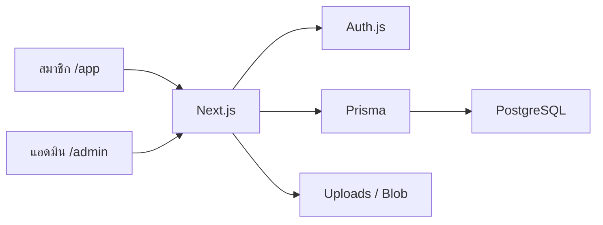

# Support Link

ระบบแลกเปลี่ยนลิงก์ **Shopee Affiliate** สำหรับกลุ่มคลิกคืน  
ส่งลิงก์ กดคืน อัปโหลดหลักฐาน ดูสถิติ และตรวจสลิปได้จากที่เดียว

เปิดแอปที่ [http://localhost:3000](http://localhost:3000) หลังติดตั้งตามด้านล่าง

---

## Tech stack

| ชั้น | เทคโนโลยี |
| --- | --- |
| App | [Next.js 16](https://nextjs.org/) App Router + Turbopack |
| UI | [React 19](https://react.dev/) · [Tailwind CSS 4](https://tailwindcss.com/) · [Lucide](https://lucide.dev/) |
| Language | TypeScript |
| Auth | [Auth.js / NextAuth v5](https://authjs.dev/) (Credentials + Facebook ทางเลือก) |
| Database | PostgreSQL 16 + [Prisma 7](https://www.prisma.io/) (`pg` adapter) |
| Validation | [Zod](https://zod.dev/) |
| Files | เครื่องตัวเองใช้ `public/uploads` · โปรดักชันใช้ [Vercel Blob](https://vercel.com/storage/blob) |
| Runtime | Node.js 20+ · Docker Compose สำหรับฐานข้อมูลท้องถิ่น |

ฟอนต์: **Anuphan** (ไทย) · **Taviraj** (หัวข้อ) · **IBM Plex Mono** (นาฬิกา)



---

## สิ่งที่ระบบทำได้

- สมาชิกส่งลิงก์รายวัน แล้วกดคืนให้เพื่อน พร้อมอัปโหลดรูปหลักฐาน
- กระดานงานค้าง สถิติกลุ่ม และโหวตสลิปที่ไม่ใช่
- แอดมินจัดการสมาชิก (อนุมัติ / พัก / แบน / ลบ) ตรวจสลิป และตั้งค่ากลุ่ม
- ธีมมืดทั้งเว็บ มีเสียงคลิกและแจ้งเตือน (ปิดได้จากปุ่มลำโพงมุมล่างซ้าย)

---

## ติดตั้ง

ต้องมี **Node.js 20+** และ **Docker Desktop** (หรือ PostgreSQL ของตัวเอง)

```bash
git clone https://github.com/DEVSKB666/Shopee-Affiliate.git
cd Shopee-Affiliate

docker compose up -d
cp .env.example .env
npm install
npx prisma db push
npm run db:seed
```

ถ้าไม่ใช้ Docker ให้แก้ `DATABASE_URL` ใน `.env` ให้ชี้ไปยัง Postgres ของคุณ แล้วรัน `npx prisma db push` ตามด้วย `npm run db:seed`

---

## วิธีรัน

```bash
npm run dev
```

เปิด [http://localhost:3000](http://localhost:3000)

| บทบาท | ยูสเซอร์เนม | รหัสผ่าน |
| --- | --- | --- |
| แอดมิน | `admin` | `Admin1234!` |
| สมาชิกตัวอย่าง | `mira` · `pong` · `nicha` · `beam` | `Demo1234!` |

คำสั่งที่ใช้บ่อย

```bash
npm run lint          # ตรวจโค้ด
npm run build         # บิลด์โปรดักชัน
npm run db:studio     # เปิด Prisma Studio
npm run db:seed       # ใส่แอดมินและสมาชิกตัวอย่าง
```

---

## ตัวแปรแวดล้อม

คัดลอกจาก `.env.example`

| ตัวแปร | ความหมาย |
| --- | --- |
| `DATABASE_URL` | ลิงก์ Postgres |
| `AUTH_SECRET` | ความลับเซสชัน ควรสุ่มยาวๆ |
| `AUTH_TRUST_HOST` | ใส่ `true` เมื่อรันบนโฮสต์ที่เชื่อถือได้ |
| `ADMIN_PASSWORD` | รหัสแอดมินตอน seed |
| `AUTH_FACEBOOK_ID` / `AUTH_FACEBOOK_SECRET` | ล็อกอิน Facebook (ไม่บังคับ) |
| `BLOB_READ_WRITE_TOKEN` | อัปโหลดรูปบน Vercel |

อย่า commit ไฟล์ `.env`

---

## Deploy บน Vercel

1. Import รีโปนี้ แล้วตั้ง Root Directory เป็นรากโปรเจกต์
2. สร้างฐาน [Neon](https://neon.tech/) แล้วใส่ `DATABASE_URL`
3. ใส่ `AUTH_SECRET` และ `AUTH_TRUST_HOST=true`
4. สร้าง Blob store แล้วใส่ `BLOB_READ_WRITE_TOKEN`
5. รัน `npx prisma db push` กับฐานโปรดักชัน จากนั้น seed เฉพาะครั้งแรก

บน Vercel อย่ารัน seed ซ้ำถ้ามีข้อมูลจริงแล้ว

---

## โครงสร้างคร่าวๆ

```
app/            หน้าเว็บ: แรก, ล็อกอิน, สมาชิก, แอดมิน
actions/        Server Actions
components/     UI สมาชิก แอดมิน และชิ้นส่วนร่วม
lib/            Prisma, เวลาไทย, อัปโหลด, เสียง
prisma/         schema + seed
auth.ts         Auth.js
```
